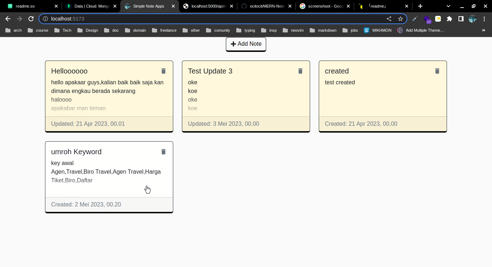

# Simple Note Web App

This is simple Note app that can make your life easier, (I thought so :stuck_out_tongue_closed_eyes:)

# Table of contents

- [Screenshots](#screenshots)
- [Features](#features)
- [Usage](#setup-mongo)

## Screenshots



## Features

- Sign Up
- Log In
- CRUD Notes

## Tech Stack

**Client:**<br/>
  
<br/>
**Server:**<br/>
    

## Setup Mongo

Before We use this app, we need to setup mongoo.
if You dont have mongodb account, you need to make one (if you dont know how to make it, google it.)
okay ,now we need to log in to the [MongoDB](https://account.mongodb.com/account/login?signedOut=true)<br/>

**after log in to mongodb**

<ul>
<li>
Add the current IP address to the whitelist.
</li>
<li>
Create a new database by clicking on "Build a Database."
</li>
<li>
Choose a hosting option (For this project, I'm selecting the free one).
</li>
<li>
Select the cloud provider (I'm choosing AWS).
</li>
<li>
Choose the region closest to your location.
</li>
<li>
Select the cluster tier (Mine: M0 Sandbox).
</li>
<li>
Enable protection.
</li>
<li>
Rename the cluster with a desired name.
</li>
<li>
Create a username and password and make sure to remember them.
</li>
<li>
Click on the "Finish & Close" button.
</li>
</ul>
On your database, click the 'Connect' button, and then choose the driver.<br/>
Copy the environment variable that we will need in the backend code.<br/>
It should look like this.<br/>

```
mongodb+srv://<username>:<password>@cluster0.buuz3c8.mongodb.net/
?retryWrites=true&w=majority
```

## Environment Variables

To run this project, you will need to add the following environment variables to your .env file

`MONGO_CONNECTION`
Fill with Environment that we get before

`PORT`
I'm use 5000

`SESSION_SECRET`
Fill with your desire word

## Run Locally

Clone the project

```bash
  git clone https://github.com/ocitocit/MERN-NotesApp.git
```

<br/>
Go to the BackEnd project directory

```bash
  cd MERN-NotesApp/backend
```

Install dependencies on BackEnd

```bash
  npm install
```

<br/>
Go to the FrontEnd project directory

```bash
  cd ../frontend
```

Install dependencies on FrontEnd

```bash
  yarn
```

<br/>
<br/>
go back to backend dir
Start the BackEnd server

```bash
  npm start
```

go back to frontend dir
Start the FrontEnd server

```bash
  yarn dev
```

## Lessons Learned

<ul>
<li>
I learned to use Node while working on this project, managing errors for the APIs that I created.
</li>
<li>
It's difficult to deploy MERN. I've been searching for ways to deploy it for free, but haven't found any. If you know how to deploy it for free, please let me know. For my next project, I'll be creating a full stack app with Next.js to make deployment easier.
</li>
</ul>

## Credit

Thanks to [@codinginflow](https://github.com/codinginflow) for teaching me how to create this project.
